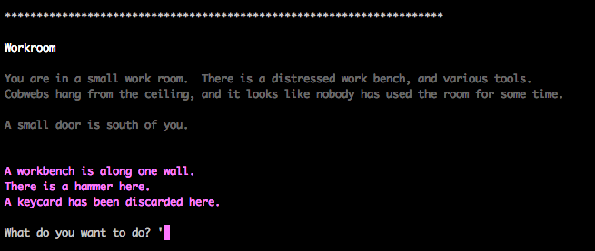

This is a text based science fiction themed adventure game, written in Python 3.
The database back end is created in SQLite3.




The game is still under development, there are plenty of non-working features!


Any help is appreciated :)

Dependancies
------------
Currently the game depends on python3 and sqlite3.
We are currently devloping the game to run under Linux, it's not been tested in windows.

Setup
-----
On OSX / Linux, at the command line, run the following commands:-

```Shell
# git clone http://github.com/colebrooke/adventure.git
# cd adventure
# chmod +x adventure.py
# chmod +x setup.sh
# ./setup.sh
# ./adventure.py
```

The setup.sh bash script is to create the .db binary from the game.sql file.


Note about commiting
--------------------
Run the `pre-commit-db-changes.sh` script prior to commiting, if you've made changes to the database.  This will save the entire sqlite database as a text file, which works much better with source control. 


Contributors
------------
- [Jensen Miller](http://github.com/colebrooke101)
- [Justin Miller](http://github.com/colebrooke)
- [Clarkie](http://github.com/clarkie)

